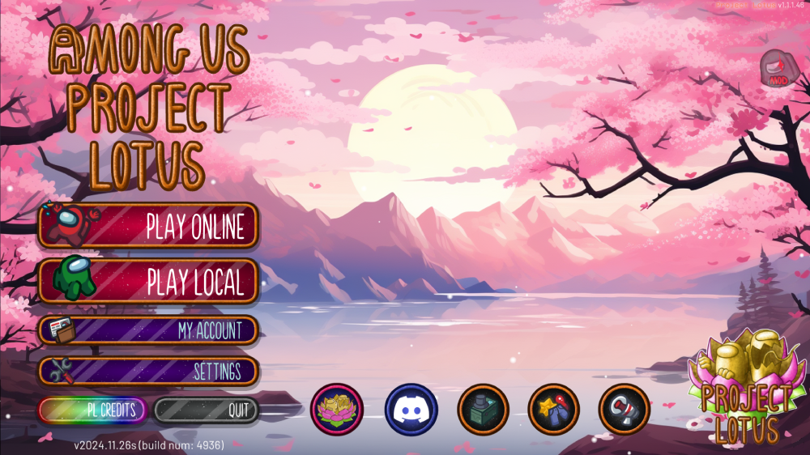

  

<h1 align="center">Project: Lotus</h1>

<h2 align="center"> <a href="https://discord.gg/projectlotus">Discord</a> | <a href="#table-of-contents">Table Of Contents</a> | <a href="https://beta.lotusau.top/">Website</a> | <a href="https://github.com/lotus-au/lotuscontinued/releases/latest">Latest Release (For AU 2024.8.13)</a>

<h3 align="center">This is a continuation of the <a href="https://github.com/ImaMapleTree/Lotus">original Project Lotus mod</a> due to the original creator passing the project. </h3>
<i align="center">This mod is not affiliated with Among Us or Innersloth LLC, and the content contained therein is not endorsed or otherwise sponsored by Innersloth LLC. Portions of the materials contained herein are the property of Innersloth LLC.</i>

---

|  |
| :--------------------------------------------------------------------------: |
|               A screenshot of the Main Menu of Project: Lotus.               |

## Regarding This Mod

#### ⭐Please consider starring our repo if you enjoy the mod!⭐

This Mod only needs to be installed on the **Host**, whom needs to be on a PC. Once it is, anyone on any device may join the lobby to enjoy the mod.  

- Anyone with a PC may also install the mod to join the **Host** to unlock extra features (See Below), but this is not required.
- Please note though, that if the **Host** of the modded lobby leaves, the modded lobby will end and the game will go back to being vanilla. This is the case unless another modded player becomes **Host** of the lobby.

#### Benefits Of Being A Modded Client. 

- Custom start screen displaying your Role's name and what to do.
- Custom victory screen reflecting the Role's unique win condition.
- Usable Hotkeys.
- Better compatability.

---

# Table of Contents.

> Note: Most of these will link to our Website, [lotusau.top](https://lotusau.top).  

> [**Click here to get taken to the roles!**](https://lotusau.top/en/roles)

|                  Getting Started with Project: Lotus                  |                 Features of This Mod.                  |                   For Developers                    |  🪷  |     Information      |                    🪷                     |
| :-------------------------------------------------------------------: | :----------------------------------------------------: | :-------------------------------------------------: | :-: | :------------------: | :--------------------------------------: |
|   [**Converting from other mods**](https://lotusau.top/rd/convert)    |     [Templates](https://lotusau.top/rd/templates)      |                          .                          |  🪷  | **General Options**  | [Here.](https://lotusau.top/rd/options)  |
|         [Installing the mod!](https://lotusau.top/rd/install)         |   [Custom Cosmetics](https://lotusau.top/rd/touhats)   | [Add-On System](https://dev.lotusau.top/rd/addons)  |  🪷  | **Commands/Hotkeys** | [Here.](https://lotusau.top/rd/commands) |
| [Setting up your First Templates.](https://lotusau.top/rd/f-template) |    [User Tags/Titles](https://lotusau.top/rd/tags)     | [VentFramework Docs](https://dev.lotusau.top/rd/vf) |  🪷  |    **All Roles**     |  [Here.](https://lotusau.top/en/roles)   |
|      [Making your first Tag!](https://lotusau.top/rd/first-tag)       | [Custom Friend System](https://lotusau.top/rd/friends) |                          .                          |  🪷  |   **Mod Credits**    |   [Here.](https://lotusau.top/credits)   |
|        [Afterthought.](https://lotusau.top/rd/gs-afterthought)        |          [Online Template Maker (Planned)](#)          |                          .                          |  🪷  |          .           |                    .                     |

 
 
 
 
 
 
 
 
 
 
 
 
 
 
 
 
thank you for using this mod, & lotus forever 🪷
