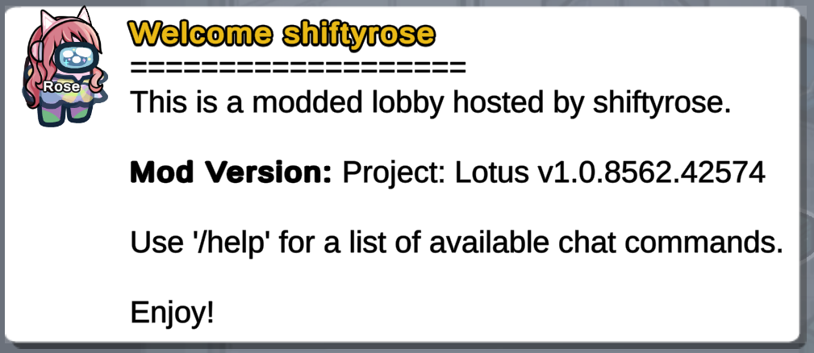
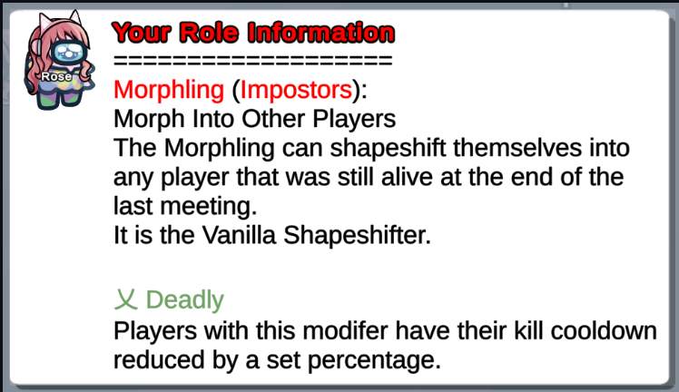
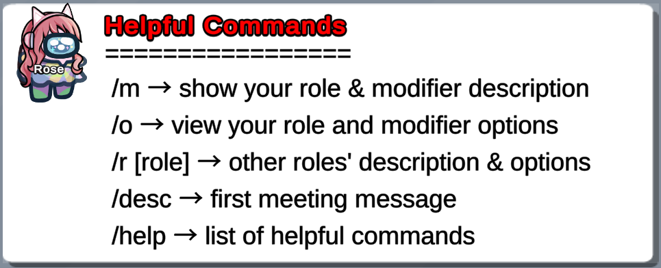
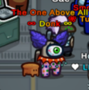
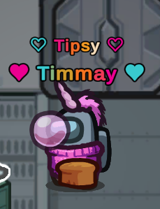

<p align="center">
  
</p>
<h3 align="center">This is a continuation of the <a href="https://github.com/ImaMapleTree/Lotus">original Project Lotus mod</a> due to the original creator passing the project. </h3>

<h2 align="center"> <a href="https://discord.gg/projectlotus">Discord</a> | <a href="#table-of-contents">Table Of Contents</a> | <a href="https://beta.lotusau.top/">Website</a> | <a href="https://github.com/lotus-au/lotuscontinued/releases/latest">Latest Release (For 2024.8.13)</a>

## Regarding This Mod

Project: Lotus (The Mod) is considered a Host Only Mod (or, Host Only Environment). This means that only The Host needs to install the mod (on a Windows Operating System) for it to work. Once The Host creates a modded lobby, clients (players) from any device are able to join and enjoy The Mod.<br>

#### The Following Restriction(s) Apply<br>

- If The Host leaves in the middle of a game, The Mod will no longer work (i.e. the roles will no longer function as intended). This happens regardless of whether the client is modded (has joined with The Mod) or not (termed 'vanilla').<br>

#### Benefits Of Being A Modded Client.<br>

- Custom start screen displaying Role Name & Ability/Win Condition (Victory Parameters)
- Custom victory screen reflecting the Role's unique win condition.
- Ability to view additional settings in lobby.
- Usable Hotkeys

---

# Features

## Hotkeys (Host Only)

#### Usable in Game

| Function            | HotKey               |
| ------------------- | -------------------- |
| Terminate the game  | `Shift`+`L`+`Enter`  |
| Skip meeting to end | `Shift`+`M`+`Enter`  |
| Force meeting       | `RShift`+`M`+`Enter` |

#### Usable In Meeting

| Function                  | HotKey           |
| ------------------------- | ---------------- |
| Execute clicked player    | `Ctrl`+`RMB`     |
| Send messages to all      | `LShift`+`Enter` |
| Send messages to the dead | `RShift`+`Enter` |

#### Usable During Countdown

| Function                     | HotKey  |
| ---------------------------- | ------- |
| Cancel game start & autoplay | `C`     |
| Start the game immediately   | `Shift` |

#### Usable In Settings

| Function                       | HotKey          |
| ------------------------------ | --------------- |
| Reset default settings/options | `Ctrl`+`Delete` |

#### Usable In Lobby

| Function              | HotKey       |
| --------------------- | ------------ |
| Reload language files | `Ctrl` + `T` |

---

## Hotkeys (Mod Clients Only)

#### Usable In Lobby

| Function                       | HotKey          |
| ------------------------------ | --------------- |
| Next page in option shower     | `Tab`           |
| Previous page in option shower | `LCtrl` + `Tab` |

#### Usable In Chat

| Function                        | HotKey     |
| ------------------------------- | ---------- |
| Paste the text                  | `Ctrl`+`V` |
| Go back in chat send history    | `↑`        |
| Go forward in chat send history | `↓`        |

#### Usable Anywhere

| Function              | HotKey      |
| --------------------- | ----------- |
| Increase Resolution   | `Ctrl`+`+`  |
| Decrease Resolution   | `Ctrl`+`-`  |
| Output log to desktop | `Ctrl`+`F1` |

---

## Chat Commands

### Host Only

| Function                        | Command        | Aliases      |
| ------------------------------- | -------------- | ------------ |
| Shows all players and their IDs | `/id`          |              |
| Displays message to ALL players | `/say [msg]`   | `/s [msg]`   |
| Kicks the provided player       | `/kick [name]` | `/kick [id]` |
| Bans the provided player        | `/ban [name]`  | `/ban [id]`  |
| Output log to desktop           | `/dump`        | `Ctrl`+`F1`  |
| Reloads local title files       | `/tload`       |              |

### All Clients

#### About The Most Recent Game

| Function          | Command       | Aliases |
| ----------------- | ------------- | ------- |
| Show Game Results | `/lastresult` | `/l`    |
| Show Winner       | `/winner`     | `/w`    |

#### Configurable Commands

| Function        | Command  |
| --------------- | -------- |
| Change My Color | `/color` |
| Change My Level | `/level` |
| Change My Name  | `/name`  |

#### General Lobby/Game Info

| Function                   | Command         | Aliases     |
| -------------------------- | --------------- | ----------- |
| Show Active Roles Settings | `/now roles`    | `/n r`      |
| Show Active Settings       | `/now`          | `/n`        |
| Show % for All Roles > 0%  | `/perc`         | `/p`        |
| Show Role Description      | `/roles [role]` | `/r [role]` |

#### Player Info In Game

| Function                    | Command        | Aliases |
| --------------------------- | -------------- | ------- |
| Show Basic Role Description | `/myrole`      | `/m`    |
| Show Current Role Option    | `/options`     | `/o`    |
| Show Full Role Description  | `/description` | `/desc` |

---

Templates (README)

## Templates

**Location**: `LOTUS_DATA/Templates.yaml`<br>
**Chat Command**: /t _or_ /template _or_ /templates [tag]<br>

Templates allow you to send pre-written and frequently used blocks of text in chat. They offer endless possibilities and are commonly used for various purposes, such as welcome messages, rules, first meeting messages, and commonly used statements.

To access your saved templates, you or another player can type /t [tag] (e.g. /t rules). If the host types the message, the tag will be hidden (so no one will know you are using it to show messages), but the text will be shown to everyone. If a player types the same command, the tag will show for everyone, but the message will be shown privately (only to the player).

#### Command Guide

This table serves as a quick reference for the different commands you can use with the template system. The host can use tags to customize the lobby and help players understand the game.

| Command             | Alias               | Description                                       |
| ------------------- | ------------------- | ------------------------------------------------- |
| `/t list`           | `/t l`              | Lists all templates by ID (and their tags)        |
| `/t tags`           |                     | Shows all tags built into the mod                 |
| `/t variables`      | `/t v`              | Shows all variables that can be used in templates |
| `/t reload`         |                     | Reloads all templates                             |
| `/t [tag]`          | `/[alias]`          | Shows template to all players                     |
| `RShift`+`/t [tag]` | `RShift`+`/[alias]` | Shows template to dead players                    |

#### Tag Customization

Project Lotus has a number of built-in tags. These tags will automatically be displayed when certain lobby/meeting events happen. These are optional, but allow you to further customize your lobby.

| Tag                | Description                                               |
| ------------------ | --------------------------------------------------------- |
| lobby-join         | Tag for the template shown to players joining the lobby.  |
| autostart          | Template triggered when the autostart timer begins.       |
| meeting-first      | The template to show during the first meeting.            |
| meeting-subsequent | The template to show during all meetings after the first. |
| meeting-start      | The template to show during each meeting.                 |

#### Usable Variables

This table serves as a quick reference for the different variables that can be utilized in templates.

| Name                 | Variable               | Output                                                                               |
| -------------------- | ---------------------- | ------------------------------------------------------------------------------------ |
| All Modifiers        | ${AllModifiers}        | A list of all modifiers in the mod                                                   |
| All Roles            | ${AllRoles}            | A categorized list of all roles in the mod                                           |
| Alive Crewmate Count | ${AliveCrewmateCount}  | A count of all alive crewmates                                                       |
| Alive Impostor Count | ${AliveImpostorCount}  | A count of all alive impostors                                                       |
| Alive Neutrals Count | ${AliveNeutralsCount}  | A count of all alive neutrals                                                        |
| Alive Player Count   | ${AlivePlayerCount}    | A count of all alive players                                                         |
| Alive Players        | ${AlivePlayers}        | All alive player names, separated by comma                                           |
| AU Version           | ${AUVersion}           | The current version of Among Us                                                      |
| Blurb                | ${Blurb}               | The player's role blurb                                                              |
| Color                | ${Color}               | The color of the player's avatar                                                     |
| Crewmate Count       | ${CrewmateCount}       | A count of all crewmates                                                             |
| Crewmates            | ${Crewmates}           | All crewmate names, separated by comma                                               |
| Date                 | ${Date}                | The current date (based on host)                                                     |
| Dead Players         | ${DeadPlayers}         | All dead player names, separated by comma                                            |
| Dead Player Count    | ${DeadPlayerCount}     | A count of all dead players                                                          |
| Death                | ${Death}               | A player's CoD                                                                       |
| Description          | ${Description}         | The player's role description                                                        |
| Faction              | ${Faction}             | The player's faction                                                                 |
| Game Mode            | ${GameMode}            | The current game mode selected                                                       |
| Host                 | ${Host}                | The host's name                                                                      |
| ImpostorCount        | ${ImpostorCount}       | A count of all impostors                                                             |
| Impostors            | ${Impostors}           | All impostor names, separated by comma                                               |
| Killer               | ${Killer}              | A player's killer                                                                    |
| Level                | ${Level}               | A player's level                                                                     |
| Map                  | ${Map}                 | The name of the last map selected                                                    |
| Mod Name             | ${ModName}             | The current mod name                                                                 |
| Mod Version          | ${ModVersion}          | The current mod version                                                              |
| Modifiers            | ${Modifiers}           | Shows the player's modifiers as a list of names                                      |
| Mods Descriptive     | ${ModsDescriptive}     | Displays the description for each of a player's modifiers                            |
| My Role              | ${MyRole}              | Echoes the text of /myrole which shows the player's role and role description.       |
| Name                 | ${Name}                | The player's name                                                                    |
| NeutralKillers       | ${NeutralKillers}      | All neutral killer names, separated by comma                                         |
| NeutralKillersCount  | ${NeutralKillersCount} | A count of all neutral killers                                                       |
| Neutrals             | ${Neutrals}            | All neutral names, separated by comma                                                |
| NeutralsCount        | ${NeutralsCount}       | A count of all neutrals                                                              |
| Option Name          | ${OptionName.[Name]}   | Shows the NAME of an option (as in current lang)                                     |
| Options              | ${Options}             | The player's role options                                                            |
| Player Count         | ${PlayerCount}         | A count of all players currently in lobby                                            |
| Players              | ${Players}             | A list of player names separated by a comma                                          |
| Role                 | ${Role}                | The player's role                                                                    |
| Room Code            | ${RoomCode}            | The current room code                                                                |
| Tasks Complete       | ${TasksComplete}       | The # of tasks a player has completed                                                |
| Tasks Remaining      | ${TasksRemaining}      | The # of tasks a player has remaining                                                |
| Time                 | ${Time}                | The current time (based on host)                                                     |
| Total Tasks          | ${TotalTasks}          | A player's total # of tasks                                                          |
| Trigger Meta         | ${TriggerMeta}         | This variable resolves differently based on the trigger the template is invoked from |

### Template Customization

There are endless possibilities when it comes to template customization in Project: Lotus. Not only are all the variables above usable in any templates created by the host, hosts can also use HTML and symbols to customize their templates even further.

Here are some basic tools to get you started:

#### Usable HTML Tags

| HTML Tag    | Description                         |
| ----------- | ----------------------------------- |
| `<b>`       | Bold text                           |
| `<i>`       | Italicized text                     |
| `<u>`       | Underlined text                     |
| `<s>`       | Strikethrough text                  |
| `<sub>`     | Subscript text                      |
| `<sup>`     | Superscript text                    |
| `<mark>`    | Highlighted or marked text          |
| `<size= >`  | Size of text (Default AU size is 2) |
| `<color= >` | Color of the text (use hex code)    |

#### Usable Unicode Symbols

乂 ⁂ ¤ § ∮ 彡 个 《 「 」 人 요 〖 〗 ロ 米 卄 王 ī l 【 】 · ㅇ ° ◈ ◆ ◇ ◥ ◤ ◢ ◣ 《 》 ︵︶ ★ ☆ ☀ ☂ ☹ ☺ ♥ ♡ ♩ ♪ ♫ ♬ ✓ ♠ ☎ ♀ ♂ ☜ ☝ ☞ ☟ ☯ ☃ ✿ ❀ ☁ ¿ ※ ⁑ ∞ ≠ + ÷ º

#### Blank Template

```
Templates:
- Tag:
  Aliases: []
  Title:
  Text:
```

#### Default Template

```
Templates: #This is necessary for the file, do not remove this line!


- Tag: lobby-join #Notice that there is a hyphen (-) before the Tag, it is necessary when creating new tags. This is the text entered after '/t'
  Aliases: [welcome] #Aliases can be used to create custom commands (i.e. no need for '/t'). This Alias allows for '/welcome' to generate the same response as '/t lobby-join'
  Title: <color=#e9b915>Welcome ${Name}</color> #This is the text that will appear in place of the host's name at the top of the message in chat.
  Text: | #This pipe (|) allows for conditional formatting (line breaks can easily be attained by pressing enter). Each line MUST have one space indented from the 'Text:' column
   ===================
   This is a modded lobby hosted by ${Host}.

   <b>Mod Version:</b> Project: Lotus v${ModVersion}

   Use '/help' for a list of available chat commands.

   Enjoy!


- Tag: rules
  Aliases: [rules]
  Title: Lobby Rules
  Text: #Fill this in with your lobby rules. Some examples for this could be 'do not claim roles unless you have important info' or 'saying start results in auto-kick'


- Tag: meeting-first
  Title: Your Role Information
  Text: |
    ===================
    ${Role} (${Faction}):
    ${Blurb}
    ${Description}

    ${ModsDescriptive}


- Tag: meeting-start
  Title: Helpful Commands
  Text: |
   =================
    /m → show your role & modifier description
    /o → view your role and modifier options
    /r [role] → other roles' description & options
    /desc → first meeting message
    /help → list of helpful commands
```

---

#### Default lobby-join Template



#### Default meeting-first Template



#### Default meeting-start Template



#### Useful Templates Not Included With Defaults

##### Nicer meeting-first Template

```
- Tag: meeting-first
  Title: "${Role} (${Faction})\n<sup>Modifiers: ${Modifiers}"
  Text: |
   \n================

   You are the ${Role}

   ${Description}

   ${ModsDescriptive}
```

##### Helpful Alchemist Templates

```
- Tag: ai
  Aliases: [ai]
  Title: Alchemist Ingredient List
  Text: |
   ------------------------------------------------------
    <color=#89a0a0>◆ = Catalyst</color> (Source: Completing Tasks)
    <color=#d15914>Θ = Theta Rift</color> (Source: Random Spawn)
    <color=#96c185>⚠ = Vial of Decay</color> (Source: Dead Bodies)
    <color=#ffaced>❀ = Shifting Rose</color> (Source: Shapeshifters)
    <color=#8c28bc>☀ = Essence of Sight</color> (Source: Fixing Lights)
    <color=#72ff75>◯ = Fragment of Discussions</color> (Source: Groups of 3 or more people)
- Tag: ap
  Aliases: [ap]
  Title: Alchemist Potions:
  Text: |
   ------------------------------------------------------
    <color=#96c15b>Potion of Death</color>:
    Kills the nearest player

    <color=#d4d45e>Castling Brew</color>:
    Applies a 1-time use shield to the player

    <color=#9900ff>Potion of Sight</color>:
    Increases players vision for 60 seconds OR removes sabotage vision

    <color=#ff389b>Warp Potion</color>
    Teleports you and a random player

    <color=#0000ff>Mechanic's Mix</color>:
    Allows player to instant fix next sabotage

    <color=#6a8759>Leader Potion</color>:
    Gives +1 vote during the next meeting

    <color=#FFEDF9>S</color><color=#FFE4F4>e</color><color=#FFDCEE>r</color><color=#FFD4E8>e</color><color=#FFCBE2>n</color><color=#FFC3DC>e</color><color=#FFBBD7> </color><color=#FFB2D1>G</color><color=#FFAACB>r</color><color=#FFA2C5>a</color><color=#FF99BF>c</color><color=#FF91BA>e</color>:
    Reveals the role of the most nearby player

    <color=#FF0000>U</color><color=#FF2A00>n</color><color=#FF5500>s</color><color=#FF7F00>t</color><color=#FFA301>a</color><color=#FFC702>b</color><color=#FFEB04>l</color><color=#AAF102>e</color><color=#55F801> </color><color=#00FF00>C</color><color=#00D455>o</color><color=#00AAA9>n</color><color=#007FFF>c</color><color=#0055FF>o</color><color=#002AFF>c</color><color=#0000FF>t</color><color=#2A00FF>i</color><color=#5400FF>o</color><color=#7F00FF>n</color>:
    Mutates into a random potion"
- Tag: api
  Aliases: [api]
  Title: Alchemist Potion Ingredients
  Text: |
   ------------------------------------------------------
    <color=#96c15b>Potion of Death</color>: <color=#96c185>
    ⚠ Vial of Decay</color> + <color=#89a0a0>◆ Base Catalyst Amount</color>

    <color=#d4d45e>Castling Brew</color>:
    <color=#89a0a0>(2) ◆ Catalyst</color> +  <color=#89a0a0>◆ Base Catalyst Amount</color>

    </color=#9900ff>Potion of Sight</color>:
    <color=#8c28bc>☀ = Essence of Sight</color> + <color=#89a0a0>◆ Base Catalyst Amount</color>

    <color=#ff389b>Warp Potion</color>:
    <color=#d15914>Θ = Theta Rift</color> + <color=#89a0a0>◆ Base Catalyst Amount</color>

    <color=#0000ff>Mechanic's Mix</color>:
    <color=#72ff75>◯ = Fragment of Discussions</color> + <color=#89a0a0>◆ Base Catalyst Amount</color>

    <color=#6a8759>Leader Potion</color>:
    <color=#72ff75>◯ = Fragment of Discussions</color> + <color=#89a0a0>◆ Base Catalyst Amount</color>

    <color=#FFEDF9>S</color><color=#FFE4F4>e</color><color=#FFDCEE>r</color><color=#FFD4E8>e</color><color=#FFCBE2>n</color><color=#FFC3DC>e</color><color=#FFBBD7> </color><color=#FFB2D1>G</color><color=#FFAACB>r</color><color=#FFA2C5>a</color><color=#FF99BF>c</color><color=#FF91BA>e</color>:
    <color=#ffaced>(2) ❀ Shifting Rose</color> + <color=#89a0a0>◆ Base Catalyst Amount</color>

    <color=#FF0000>U</color><color=#FF2A00>n</color><color=#FF5500>s</color><color=#FF7F00>t</color><color=#FFA301>a</color><color=#FFC702>b</color><color=#FFEB04>l</color><color=#AAF102>e</color><color=#55F801> </color><color=#00FF00>C</color><color=#00D455>o</color><color=#00AAA9>n</color><color=#007FFF>c</color><color=#0055FF>o</color><color=#002AFF>c</color><color=#0000FF>t</color><color=#2A00FF>i</color><color=#5400FF>o</color><color=#7F00FF>n</color>:
    <color=#d15914>(2) Θ Theta Rift</color> + <color=#89a0a0>◆ Base Catalyst Amount</color>
```

### Note On Template Creation

- The hyphen (-) is required
- The colon and space after it are required
- The indentation of the word Text (aligning with the indentation of the word Tag) is required
- You must capitalize Tag and Text (and any other parameter used in Template.yaml)

---

## Friends

The native Among Us friends list is often considered pointless. However, with this system, you can create your own custom friend list easily using simple commands through the command line.

The friend list information is stored in the file `LOTUS_DATA/Friends.txt`.

Commands:

| Command                  | Function                                        |
| ------------------------ | ----------------------------------------------- |
| `/friend add [playerId]` | Adds a friend based on their player ID (1 - 15) |
| `/friend add [name]`     | Adds a friend based on their username           |
| `/friend remove [index]` | Removes a friend based on their list position   |
| `/friend list`           | Lists all friends                               |

## Other Useful Commands

Here are some additional commands that you might find useful:

- `/kick [id]`: Kick a player based on their ID.
- `/ban [id]`: Ban a player based on their ID.

Use `/kick` or `/ban` without specifying an ID to obtain a list of available player IDs.

## Custom Tags

**Location**: `LOTUS_DATA/Titles'<br>
**File Type**: yaml<br>
**File Name**: Among Us Friend Code (e.g. envykindly#7034)<br>

Custom tags allow for players to add colors to their username as well as titles above their username in Among Us. In order for a host to add a players custom tag, they'll need to create a yaml file with any/all of the following information:

```
UpperText:
 Text: # This is the text that goes above your username
 Gradient: # Creates a gradient FROM Color 1 to Color 2 automatically
 Size: # Default AU size is 2

Name: # This is the size and color/gradient attributed to your username. Leave this line blank and fill in the options below
 Gradient: # Creates a gradient from Color 1 to Color 2 automatically. For gradient enter "[hex 1], [hex 2]" (refer to examples above)
 Size: # Default AU size is 2

Prefix: # This is the size, color, and text that goes before your username. Leave this line blank and fill in the options below
 Spaced: # This field is either True or False and used if there should be a space between the Suffix and the player's username (example: ♥ shiftyrose)
 Text: # Add the text you'd like to go before your username here
 Color: # Add the hex code that you'd like the prefix to be here
 Size: # Default AU size is 2

Suffix: # This is the size, color, and text that goes after your username. Leave this line blank and fill in the options below
 Spaced: # This field is either True or False and used if there should be a space between the Suffix and the player's username (example: shiftyrose ♥)
 Text: # Add the text you'd like to go before your username here
 Color: # Add the hex code that you'd like the prefix to be here
Size: # Default AU size is 2

LowerText:
 Text: # This is the text that goes below your username
 Gradient: # Creates a gradient FROM Color 1 to Color 2 automatically
 Size: # Default AU size is 2
```

**Creating A New Title**:<br>
Navigate to the `/LOTUS_DATA/Titles` directory<br>
Create a new yaml file named: `[friendcode].yaml` (example: `buffdulcet#0871.yaml`)<br>
Set up the title components in the yaml<br>

**Available Components**:<br>

| Components | Description                                          |
| ---------- | ---------------------------------------------------- |
| UpperText  | Responsible for the text above the player's username |
| LowerText  | Responsible for the text below the player's username |
| Prefix     | The text that comes before a player's username       |
| Suffix     | The text that comes after a player's username        |
| Name       | The player's username                                |

_The player's username is the name they enter the lobby with or change with /name. It is not specified directly in the yaml file._

**Component Items**: <br>

These are the things you can define for each component to change

| Item     | Description                                                                                                |
| -------- | ---------------------------------------------------------------------------------------------------------- |
| Text     | Sets the text for the component (does not work for Name)                                                   |
| Gradient | A list of HTML color codes defining a range of colors to apply to the text. (Refer to the example image)   |
| Color    | If gradient is not specified, a solid color to apply to the text                                           |
| Size     | The size of the text (default is 2)                                                                        |
| Spaced   | (Only applicable to Prefix & Suffix) Whether the text should have a space between it and the player's name |

Lastly you can reload your (local) title files with the command '/tload', the change is **immediate**<br>

### Example Tags

#### Example 1

UpperText:<br>

> Text: The One Above All<br>
> Gradient: "#ff0000, #e1e100" #Creates a gradient FROM Color 1 to Color 2 automatically<br>
> Size: 2 # Default AU size is 2, i believe this is exponential (so 100 would be terrible)<br>

Name:<br>

> Gradient: "#e1e100, #ff0000" #Creates a gradient FROM Color 1 to Color 2 automatically<br>
> Size: 2 # Default AU size is 2, i believe this is exponential (so 100 would be terrible)<br>

Prefix:<br>

> Spaced: True # If there should be a space between the Suffix and the player's name (example: Akali ♥)<br>
> Text: ∞ <br>
> Color: "#ff0000"<br>
> Size: 2 # Default AU size is 2, i believe this is exponential (so 100 would be terrible)<br>

Suffix:<br>

> Spaced: True # If there should be a space between the Suffix and the player's name (example: Akali ♥)<br>
> Text: ∞ <br>
> Color: "#e1e100"<br>
> Size: 2 # Default AU size is 2, i believe this is exponential (so 100 would be terrible)<br>

**Output**:<br>


#### Example 2

Name:<br>

> Gradient: "#3BCFD4, #FC9305, #F20094"

UpperText:<br>

> Size: 1.925<br>
> Text: ♡ Tipsy ♡<br>
> Gradient: "#3BCFD4,#F20094, #F74B4B, #FC9305,#96B373, #3BCFD4,#F20094"<br>

Prefix:<br>

> Text: ♥<bR>
> Spaced: true<br>
> Color: "#F20094"<br>

Suffix:<br>

> Text: ♥<br>
> Spaced: true<br>
> Color: "#3BCFD4"<br>

**Output**:<br>


# General Settings

---

## Admin Options

| Name                         | Description                                                                                                  |  Type  | Default  |
| ---------------------------- | ------------------------------------------------------------------------------------------------------------ | :----: | :------: |
| Host GM                      | Allows Host to spawn as a GM. This makes them a ghost from the start of the game without any roles or tasks. | Toggle |   OFF    |
| Chat AutoKick                | Automatically kick players who say certain banned words from game.                                           | Toggle | DISABLED |
| Kick Players w/o Friendcodes | Automatically kick players who do not have a friendcode from game.\*                                         | Toggle | DISABLED |
| Kick Players Under Level     | Automatically kick players who are below the defined level.                                                  | Number | DISABLED |
| Kick Mobile Players          | Automatically kick players who are playing on a mobile device.                                               | Toggle | DISABLED |
| AutoStart                    | Automatically starts the game when the set number of players is reached.                                     | Number | DISABLED |

\*This setting must be disabled if playing on a modded server.

---

## Gameplay Options

| Name                                 | Description                                                                                                      |  Type  | Default |
| ------------------------------------ | ---------------------------------------------------------------------------------------------------------------- | :----: | :-----: |
| Optimize Role Counts for Playability |                                                                                                                  | Toggle |   ON    |
| Fix First Kill Cooldown              | Overrides roles' first kill cooldown to match the one defined for their role instead of the automatic 10 seconds | Toggle |   ON    |
| Disable Tasks                        | Allows the host to disable certain tasks from showing up for players.                                            | Toggle |   OFF   |
| ┣ Disable Card Swipe                 | Disables the Card Swipe task from being given to players.                                                        | Toggle |   OFF   |
| ┣ Disable Med Scan                   | Disables the Med Scan task from being given to players.                                                          | Toggle |   OFF   |
| ┣ Disable Unlock Safe                | Disables the Unlock Safe task from being given to players. (Task is only available on Airship)                   | Toggle |   OFF   |
| ┣ Disable Upload Data                | Disables the Download/Upload Data task from being given to players.                                              | Toggle |   OFF   |
| ┣ Disables Start Reactor             | Disables the Start Reactor task from being given to players.                                                     | Toggle |   OFF   |
| ┗ Disable Reset Breaker              | Disables the Reset Breaker task from being given to players. (Task is only available on Airship)                 | Toggle |   OFF   |
| Disable Task Win                     | Disables the ability for Crewmates to win by completing all of their tasks.                                      | Toggle |   OFF   |
| Ghosts See Roles                     | Allows Ghosts (dead players) to see everyone's roles.                                                            | Toggle |   ON    |
| Ghosts See Indicators                | Allows Ghosts to see indicators (symbols or text) next to players' names.\*                                      | Toggle |   ON    |
| Ghosts Ignore Tasks                  | Allows for Crewmates to get a task win even if Ghosts do not finish their tasks.                                 | Toggle |   OFF   |
| Sync Meetings                        | Forces a global maximum number of meetings that can be called instead of each player having their own maximum.   | Number |  NEVER  |

\*Indicators may include modifiers, cursed or doused players, players who are holding a bomb or who are blackmailed etc.

---

## Sabotage Options

| Name                           | Description                                                                |  Type  | Default |
| ------------------------------ | -------------------------------------------------------------------------- | :----: | :-----: |
| Disable Sabotages              | Disables Impostor's ability to use certain sabotages.                      | Toggle |   OFF   |
| ┣ Disable Reactor              | Disables Impostor's ability to sabotage Reactor (Skeld, Mira HQ, Airship). | Toggle |   OFF   |
| ┣ Disable Oxygen               | Disables Impostor's ability to sabotage Oxygen (Skeld and Mira HQ).        | Toggle |   OFF   |
| ┣ Disable Lights               | Disables Impostor's ability to sabotage Lights.                            | Toggle |   OFF   |
| ┣ Disable Communications       | Disables Impostor's ability to sabotage Communications.                    | Toggle |   OFF   |
| ┣ Disable Doors                | Disables Impostor's ability to close Doors.                                | Toggle |   OFF   |
| ┗ Disable Crash Course         | Disables Impostor's ability to sabotage Crash Course (Airship only).       | Toggle |   OFF   |
| Skeld Reactor Countdown        | Customizes Countdown to fix Reactor on Skeld before death.                 |  Time  | DEFAULT |
| Skeld Oxygen Countdown         | Customizes Countdown to fix Oxygen on Skeld before death.                  |  Time  | DEFAULT |
| Mira Reactor Countdown         | Customizes Countdown to fix Reactor on Mira HQ before death.               |  Time  | DEFAULT |
| Mira Oxygen Countdown          | Customizes Countdown to fix Oxygen on Mira HQ before death.                |  Time  | DEFAULT |
| Polus Reactor Countdown        | Customizes Countdown to fix Reactor on Polus before death.                 |  Time  | DEFAULT |
| Airship Crash Course Countdown | Customizes Countdown to fix Crash Course on Airship before death.          |  Time  | DEFAULT |

---

## Mayhem Options

| Name               | Description                                                                                         |  Type  | Default |
| ------------------ | --------------------------------------------------------------------------------------------------- | :----: | :-----: |
| Enable Random Maps | Randomizes which map is used to play each game.                                                     | Toggle |   OFF   |
| ┣ Skeld            | Allows for Skeld to be included in the list of randomized maps.                                     | Toggle |   OFF   |
| ┣ Mira             | Allows for Mira HQ to be included in the list of randomized maps.                                   | Toggle |   OFF   |
| ┣ Polus            | Allows for Polus to be included in the list of randomized maps.                                     | Toggle |   OFF   |
| ┗ Airship          | Allows for Airship to be included in the list of randomized maps.                                   | Toggle |   OFF   |
| Random Spawn       | Makes player spawn in random places around the map instead of everyone spawning in the same spot.   | Toggle |   OFF   |
| Camo Comms         | Makes all players look the same (same color and removes outfits) when Communications are sabotaged. | Toggle |   OFF   |
| All Roles Can Vent | Gives all roles the ability to vent.                                                                | Toggle |   OFF   |

---

## Miscellaneous Options

| Name                    | Description                                                                                                      |    Type    | Default |
| ----------------------- | ---------------------------------------------------------------------------------------------------------------- | :--------: | :-----: |
| Assigned Pet            | Chooses what pet will be assigned to people who do not have a pet.\*                                             |  Options   | RANDOM  |
| Allow /name             | Allows players (choose between friends only, or everyone) to change their name using /name.                      |   Toggle   |   OFF   |
| Allow /color and /level | Allows players (choose between friends only, or everyone) to change thier color or level using /color and /level |   Toggle   |   OFF   |
| Auto Display Results    | Automatically displays the results of the last game after the game ends.                                         |   Toggle   |   ON    |
| Color Names             | Displays everyone's name as the color of their Among Us character.                                               |   Toggle   |   OFF   |
| Ladder Death            | Chance of falling from a ladder and dying (Airship Only).                                                        | Percentage |   OFF   |

\*Many roles require a pet in order to function. The game will automatically assign a pet to any players who don't have one.
